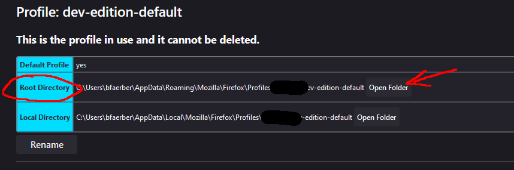
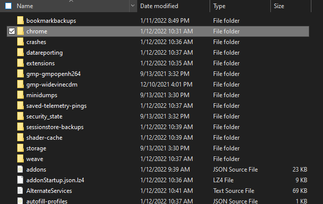
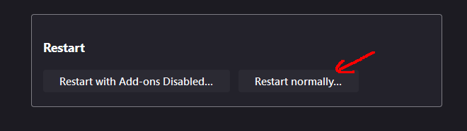

## One Monokai Theme for Firefox Devtools
A theme for Firefox Devtools.

I pair this theme with [Nord Polar Night from Christos Bouronikos](https://github.com/ChristosBouronikos/Nord-Polar-Night-Theme)

Based on the theme [One Monokai for VSCode](https://marketplace.visualstudio.com/items?itemName=azemoh.one-monokai)

### How to install:

1. Enter `about:config` in the Firefox address bar and click allow.

2. To enable `userChrome.css` custom stylesheets enter this command in the search bar:
`toolkit.legacyUserProfileCustomizations.stylesheets`, then double click the property to toggle it to true. You can now close this window.

3. Enter `about:profiles` in the Firefox address bar. Find your in use root profile and click `Open Folder`

4. Download this repository and find the `chrome` folder. Drag the `chrome` folder into the root profile folder you just opened.

5. Return to the `about:profiles` page and click `Restart Normally`.

6. Once Firefox restarts, open your dev tools. If they still look the same try restarting your computer and double check you followed this guide correctly. Enjoy!